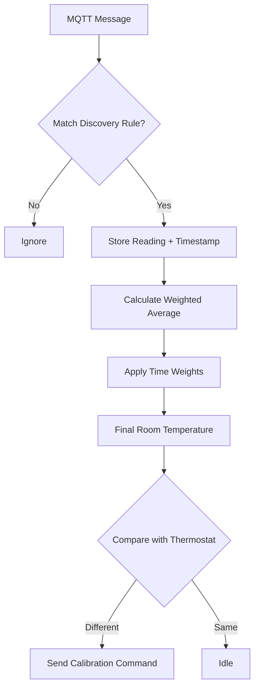

# 🌡️ Node-RED Zigbee Thermostat Calibrator

[](https://nodered.org/)
[](https://www.zigbee2mqtt.io/)
[](https://opensource.org/licenses/MIT)

A **robust** and **intelligent** Node-RED function to automatically calibrate Zigbee thermostats using external temperature sensors. Achieves **0.2°C precision** with weighted averaging of multiple sensors.

> 💡 **Why?** Built-in thermostat sensors are often inaccurate. This node synchronizes your TRV's internal temperature reading with precise external sensors (or an average of them), ensuring accurate climate control.

---

## ✨ Features (v2.0)

| Feature | Description |
|---------|-------------|
| 🎯 **Auto-Calibration** | Keeps thermostat `local_temperature` in sync with external sensors |
| 🤹 **Multi-Sensor Support** | Aggregates readings from **multiple sensors** in one room |
| ⏱️ **Time-Weighted Avg** | Prioritizes fresh readings; ignores data older than 30 mins |
| ⚖️ **Device Weighting** | Assign lower confidence (weights) to secondary sensors |
| 🔍 **Regex Discovery** | Professional regex-based rule engine for device matching |
| 🛡️ **Floating Point Safe** | Built-in rounding prevents JavaScript math errors |
| 🔁 **Smart Deduplication** | Prevents processing duplicate MQTT messages |

---

## 📦 Installation

### Method 1: Copy & Paste (Recommended)

1. **Create** a new **Function Node** in Node-RED
2. **Paste** the code from [`function.js`](./function.js)
3. **Configure** the `CONFIG` object (see below)
4. **Connect** your MQTT nodes:
   - **Input** → Connect to `mqtt in` (subscribed to `zigbee2mqtt/#`)
   - **Output** → Connect to `mqtt out` (leave topic blank)

---

## ⚙️ Configuration

V2.0 introduces a powerful **Rule-Based Discovery System**.

### 🔧 Basic Settings

```javascript
const CONFIG = {
    // Enable detailed debug logging (regex matches, calculations, etc.)
    debug: false,

    step: 0.2,                  // Calibration step
    // Per-Location Overrides
    locations: {
        "office": { 
             // Device-specific settings can go here
        }
    },

    // Prefix for Node-RED internal storage keys
    storePrefix: 'thermoCal_',  // Internal state prefix
    contextStore: 'default',    // 'default' (RAM) or 'file' (Persistence)

    // Time Weights: How much we trust data based on age
    timeWeights: {
        fresh: { maxAge: 5, weight: 1.0 },   // 0-5 mins
        normal: { maxAge: 14, weight: 0.8 }, // 5-14 mins
        old: { maxAge: 22, weight: 0.4 },    // 14-22 mins
        veryOld: { maxAge: 30, weight: 0.1 } // 22-30 mins
    },

    // Discovery Rules: Checked in order. First match wins.
    discovery: [
        // 1. Secondary Sensors (Weight 0.5)
        // Matches: zigbee2mqtt/temp_office_2 -> Location: office
        { 
            pattern: 'zigbee2mqtt/temp_(.*)_2', 
            type: 'sensor', 
            baseWeight: 0.5 
        },
        
        // 2. Primary Sensors (Weight 1.0)
        // Matches: zigbee2mqtt/temp_office -> Location: office
        { 
            pattern: 'zigbee2mqtt/temp_(.*)', 
            type: 'sensor', 
            baseWeight: 1.0 
        },
        
        // 3. Thermostats
        // Matches: zigbee2mqtt/thermostat_office -> Location: office
        { 
            pattern: 'zigbee2mqtt/thermostat_(.*)', 
            type: 'thermostat' 
        }
    ]
};
```

---

## 🧮 How It Works



### Time-Based Decay
Readings degrade in quality over time. A sensor that hasn't reported in 25 minutes will have only **10% influence** on the calculation compared to a fresh reading. Any reading older than **30 minutes** is strictly ignored.

---

## 🐛 Troubleshooting

<details>
<summary><b>Calibration not working?</b></summary>

1. Check debug logs: `node.warn` messages in the Node-RED debug panel.
2. Verify regex patterns: Ensure your MQTT topics actually match the `pattern` in `CONFIG.discovery`.
3. Check age: If sensors haven't updated in >30 mins, they are ignored.
</details>

<details>
<summary><b>Values resetting on restart?</b></summary>

- Change `contextStore: 'default'` to `contextStore: 'file'` for persistence.
</details>

---

## 🤝 Contributing

Contributions are welcome!

1. Fork it
2. Create your feature branch (`git checkout -b feature/my-feature`)
3. Commit your changes (`git commit -am 'Add some feature'`)
4. Push to the branch (`git push origin feature/my-feature`)
5. Create a new Pull Request

---

## 📄 License

This project is licensed under the **MIT License** - see the [LICENSE](LICENSE) file for details.

---

**Made with ❤️ for smart home enthusiasts**
