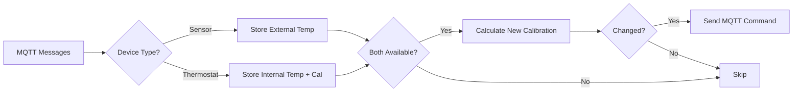

# 🌡️ Node-RED Zigbee Thermostat Calibrator

[](https://nodered.org/)
[](https://www.zigbee2mqtt.io/)
[](https://opensource.org/licenses/MIT)

A **robust** and **intelligent** Node-RED function to automatically calibrate Zigbee thermostats using external temperature sensors. Achieves **0.2°C precision** with hybrid naming strategies and smart deduplication.

> 💡 **Why?** Built-in thermostat sensors are often inaccurate. This node synchronizes your TRV's internal temperature reading with a precise external sensor, ensuring accurate climate control.

---

## ✨ Features

| Feature | Description |
|---------|-------------|
| 🎯 **Auto-Calibration** | Keeps thermostat `local_temperature` in sync with external sensors |
| 📏 **Precision Control** | Configurable calibration steps (0.1°C, 0.2°C, 0.5°C, 1°C) |
| 🔄 **Dual Naming Strategy** | Supports both automatic prefix matching AND custom topic mapping |
| 🛡️ **Floating Point Safe** | Built-in rounding logic prevents JavaScript floating point errors |
| 🔁 **Message Deduplication** | Uses `last_seen` timestamps to avoid processing duplicate MQTT messages |
| 🧠 **Smart Device Detection** | Automatically identifies device types from payload structure |
| 🏷️ **Custom Topic Support** | Works with ANY topic naming convention via manual mapping |

---

## 📦 Installation

### Method 1: Copy & Paste (Recommended)

1. **Create** a new **Function Node** in Node-RED
2. **Paste** the code from [`function.js`](./function.js)
3. **Configure** the `CONFIG` object (see below)
4. **Connect** your MQTT nodes:
   - **Input** → Connect to `mqtt in` (subscribed to `zigbee2mqtt/#`)
   - **Output** → Connect to `mqtt out` (leave topic blank)

### Method 2: Import Flow

Coming soon! (Star/watch this repo for updates)

---

## ⚙️ Configuration

All settings are in the `CONFIG` object at the top of the function.

### 🔧 Basic Settings

```javascript
const CONFIG = {
    step: 0.2,                  // Calibration step: 0.1, 0.2, 0.5, or 1
    storePrefix: 'thermoCal_',  // Storage prefix (keep unique)
    contextStore: 'default',    // 'default' (RAM) or 'file' (persistent)
    // ...
};
```

> ⚠️ **Important:** Use `contextStore: 'file'` if you want calibration to persist across Node-RED restarts.

---

### 🎯 Strategy A: Automatic Prefix Matching

**Best for:** Standard naming conventions

If your MQTT topics follow a pattern, define the prefixes. The script extracts the **Location ID** from the suffix.

#### Example

| Topic | Type | Location ID |
|-------|------|-------------|
| `zigbee2mqtt/temp_kitchen` | Sensor | `kitchen` |
| `zigbee2mqtt/thermostat_kitchen` | Thermostat | `kitchen` |

```javascript
autoPrefixes: {
    sensor: 'zigbee2mqtt/temp_',
    thermostat: 'zigbee2mqtt/thermostat_',
}
```

---

### 🏷️ Strategy B: Custom Topic Mapping

**Best for:** Random device names or complex setups

Map the **full MQTT topic** to a shared **Location ID**. Both sensor and thermostat must use the same ID.

#### Example

```javascript
customMap: {
    // Bedroom
    "zigbee2mqtt/aqara_multisensor_bed": "bedroom",
    "zigbee2mqtt/moes_trv_01": "bedroom",
    
    // Hallway
    "zigbee2mqtt/sonoff_snzb02_hallway": "hallway",
    "zigbee2mqtt/danfoss_ally_hall_01": "hallway",
    
    // Living Room
    "zigbee2mqtt/xiaomi_temp_living": "living_room",
    "zigbee2mqtt/tuya_radiator_valve_lr": "living_room"
}
```

> 💡 **Pro Tip:** You can combine both strategies! Custom mappings take priority.

---

## 🧮 How It Works



### Calibration Formula

1. **Extract Raw Internal Temperature:**
   ```
   Raw_Internal_Temp = Displayed_Thermostat_Temp - Current_Calibration
   ```

2. **Calculate New Calibration:**
   ```
   New_Calibration = External_Sensor_Temp - Raw_Internal_Temp
   ```

3. **Round to Step:**
   ```
   Rounded_Calibration = round(New_Calibration / 0.2) * 0.2
   ```

4. **Update if Changed:**
   ```
   If Rounded_Calibration ≠ Current_Calibration:
       Send zigbee2mqtt/[DEVICE]/set {"local_temperature_calibration": X}
   ```

---

## 📋 Prerequisites

- ✅ **Node-RED** (v2.0+)
- ✅ **Zigbee2MQTT** (or compatible MQTT broker)
- ✅ Thermostats with `local_temperature_calibration` support
  - ✅ Tuya TRVs (most models)
  - ✅ Danfoss Ally
  - ✅ Moes TRVs
  - ✅ Eurotronic Spirit
  - ✅ And many others...

---

## 🚀 Quick Start Example

### Scenario: Kitchen with Mismatched Names

**Devices:**
- Sensor: `zigbee2mqtt/aqara_kitchen_sensor`
- Thermostat: `zigbee2mqtt/tuya_kitchen_valve`

**Configuration:**

```javascript
const CONFIG = {
    step: 0.2,
    storePrefix: 'thermoCal_',
    contextStore: 'file',
    
    autoPrefixes: {
        sensor: 'zigbee2mqtt/temp_',
        thermostat: 'zigbee2mqtt/thermostat_',
    },
    
    customMap: {
        "zigbee2mqtt/aqara_kitchen_sensor": "kitchen",
        "zigbee2mqtt/tuya_kitchen_valve": "kitchen"
    }
};
```

**Result:** Both devices map to location `kitchen` → automatic calibration! 🎉

---

## 🐛 Troubleshooting

<details>
<summary><b>Calibration not working?</b></summary>

1. Check debug logs: `node.warn` messages in the Node-RED debug panel
2. Verify both devices have data:
   - Go to Node-RED → Menu → Context Data
   - Look for `thermoCal_sensorTemp_[location]` and `thermoCal_thermoTemp_[location]`
3. Ensure your thermostat supports `local_temperature_calibration`
</details>

<details>
<summary><b>Getting duplicate updates?</b></summary>

- The script uses `last_seen` deduplication
- If your MQTT messages don't include `last_seen`, consider adding a timestamp to payloads
</details>

<details>
<summary><b>Calibration values resetting?</b></summary>

- Change `contextStore: 'default'` to `contextStore: 'file'` for persistence
</details>

---

## 🛠️ Advanced Usage

### Multiple Sensors per Room

Average multiple sensors before calibration:

```javascript
// Inside the sensor detection block:
if (msg.payload.hasOwnProperty('temperature')) {
    const temps = flow.get(`${CONFIG.storePrefix}sensorTemps_${location}`, CONFIG.contextStore) || [];
    temps.push(msg.payload.temperature);
    if (temps.length > 3) temps.shift(); // Keep last 3 readings
    
    const avgTemp = temps.reduce((a,b) => a+b, 0) / temps.length;
    flow.set(`${CONFIG.storePrefix}sensorTemp_${location}`, avgTemp, CONFIG.contextStore);
    flow.set(`${CONFIG.storePrefix}sensorTemps_${location}`, temps, CONFIG.contextStore);
}
```

### Temperature Offset

Add a permanent offset (e.g., +0.5°C):

```javascript
const CONFIG = {
    // ... other settings
    offset: 0.5
};

// In calibration calculation:
const calculatedCalibration = (storedSensorTemp + CONFIG.offset) - rawThermostatTemp;
```

---

## 🤝 Contributing

Contributions are welcome! Here's how:

1. **Fork** this repository
2. **Create** a feature branch (`git checkout -b feature/amazing-feature`)
3. **Commit** your changes (`git commit -m 'Add amazing feature'`)
4. **Push** to the branch (`git push origin feature/amazing-feature`)
5. **Open** a Pull Request

### Ideas for Contributors

- 📊 Add support for Prometheus metrics
- 🧪 Create automated tests
- 📱 Build a configuration UI panel
- 🌐 Support for other MQTT structures (e.g., Home Assistant)

---

## 📄 License

This project is licensed under the **MIT License** - see the [LICENSE](LICENSE) file for details.

---

## ☕ Support the Project

If this node saved you time and heating bills, consider buying me a coffee! ☕

[](https://buycoffee.to/dutracki)

---

## 📚 Resources

- [Node-RED Documentation](https://nodered.org/docs/)
- [Zigbee2MQTT Supported Devices](https://www.zigbee2mqtt.io/supported-devices/)
- [MQTT Protocol Specification](https://mqtt.org/)

---

## 🙏 Acknowledgments

- The Node-RED community for their excellent documentation
- Zigbee2MQTT developers for making home automation accessible
- All contributors and issue reporters

---

**Made with ❤️ for smart home enthusiasts**
